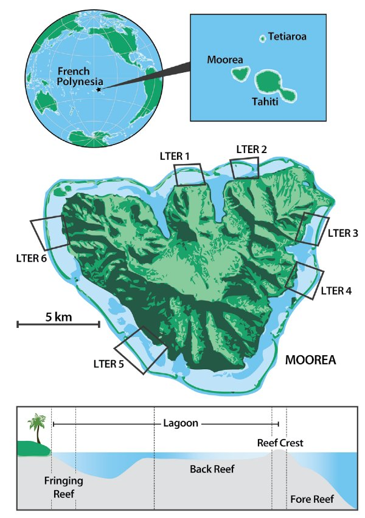

```{r setup, include=FALSE}
knitr::opts_chunk$set(echo=TRUE)
```

**The goal of this lecture is to gain the following skills:**  

1) Load and explore complex biodiversity data and be able to manipulate and summarize its content
2) Visualize observed diversity across different groups of samples
3) Understand the different between entropy and diversity metrics
4) Compute and visualize diversity metrics

Before starting make sure the following R packages are installed and loaded in your session:  

```{r Setting R, message=FALSE, warning=FALSE}
library(here)
library(tidyverse)
library(reshape2)
library(ggplot2)
library(vegan)
library(iNEXT)
library(knitr)
```

## Load and explore the data

### Data description: the Moorea Coral Reef Long-term Ecological Research
|     We will be using data on coral reef fish communities from the Moorea Island located in French Polynesia (see **Figure 1** below). This data is part of the Moorea Coral Reef Long-term Ecological Research (MCR LTER) fish monitoring program established by the National Science Foundation in 2004 as a model system to better understand factors that mediate coral community structure and function. The data is available under the Creative Commons license Attribution 4.0 International (CC BY 4.0) on the [MCR LTER Website](http://mcrlter.msi.ucsb.edu/cgi-bin/showDataset.cgi?docid=knb-lter-mcr.6&displaymodule=entity&entitytype=dataTable&entityindex=1).

<p align="center">
  
</p>

**Figure 1.** Map of the island of Moorea with locations of sampling sites (LTER 1-LTER 6) and schematic illustrating the 3 habitat types sampled at each site. 
**Source:** Leichter et al. **(2013)** Biological and physical interactions on a tropical island coral reef: transport and retention processes on Moorea, French Polynesia. Oceanography, 26: 52-63.)

|     The data describe the species abundance and size distributions of fishes since 2005. The abundances of all mobile taxa of fishes (Scarids, Labrids, Acanthurids, Serranids, etc.) observed on a five by fifty meter transect which extends from the bottom to the surface of the water column are recorded by a diver using SCUBA. The diver then swims back along a one by fifty meter section of the original transect line and records the abundances of all non-mobile or cryptic taxa of fishes (Pomacentids, Gobiids, Cirrhitids, Holocentrids etc). Surveys are conducted between 0900 and 1600 hours (Moorea time) during late July or early August each year. In 2006, divers also began to estimate the size (length) of each fish observed to the nearest half cm. Four replicate transects are surveyed in each of six locations on the forereef (two on each of Moorea's three sides), six locations on the backreef (two on each of Moorea's three sides) and on six locations on the fringing reef (two on each of Moorea's three sides) for a total of 72 individual transects. Transects are permanently marked using a series of small, stainless steel posts affixed to the reef. Transects on the forereef are located at a depth of approximately 12m, those on the backreef are located at a depth of approximately 1.5m and those on the fringing reef are located at a depth of approximately 10m.  


**Reference**    
|     Brooks. Data of Moorea Coral Reef LTER. 2021. MCR LTER: Coral Reef: Long-term Population and Community Dynamics: Fishes, ongoing since 2005. knb-lter-mcr.6.59 doi:10.6073/pasta/8a60deeb7d7e9b1abbebd0af8c773321

### Challenge 1: explore and filter the data

Data is in the following file *MCR_LTER_Annual_Fish_Survey_20210628.csv*. **Your goals are to:**  

1) Load the data
2) Explore it: what are the different column?
3) How many years were surveyed?
4) How many habitats and sites were surveyed?
5) How many taxa are there in the data?
6) Retrieve information on the taxa observed in 2015 on the 1st transect of site 1 on the forereef

### Challenge 1: answers
1) **Load the data**

We can use R function here() so R can automatically find your project's files, based on the current working directory at the time when the package is loaded. In my case the file *MCR_LTER_Annual_Fish_Survey_20210628.csv* was placed in a folder name **"data"**.
```{r}
MCR_data <- read.csv(here("data", "MCR_LTER_Annual_Fish_Survey_20210628.csv"), header=TRUE)
```


2) **Explore the data:** What are the different column?  

You can simply use the function head()
```{r}
head(MCR_data)
```

3) **How many years surveyed?**  

We will combine unique() and with()
```{r}
with(MCR_data, unique(Year))        # 2006 to 2020
```

4) **How many habitats and sites?**  

We will combine unique() and with()
```{r}
with(MCR_data, unique(Site))        # 6 sites      
with(MCR_data, unique(Habitat))     # 3 habitats
```

5) **How many taxa are there in the data?**  

We will combine unique(), length() and with(). You can also check what are the unique names in Taxonomy. Do you see any issue? 
```{r}
with(MCR_data, length(unique(Taxonomy)))    # 397 taxa detected
with(MCR_data, length(unique(Family)))      # across 53 families
with(MCR_data, unique(Fine_Trophic))        # 4 transects per site x habitat
```

6) **information on the taxa observed in 2015 on the 1st transect of site 1 on the forereef**  

We can subset our data as follow:
```{r}
Site1Tr1FO2015 <- subset(MCR_data, Habitat=="FO" & Site==1 & Transect==1 & Year==2015) %>% droplevels()
```
Now you can explore Site1Tr1FO2015 either in R console or in Rstudio. What does it tell you about the structure of the data?

### Challenge 2: what are the 10 most abundant fish taxa across all observation?

Your goal here is to create a **synthetic table** summarizing species overall relative abundance and find a way to **visualize** their relative abundance distribution. We will break down these goals into four objectives:   

1) Compute the total number of observed individuals of each species across all years, sites and habitats
2) Compute species relative abundance
3) Which are the top 10 most abundant fish species?
4) Make a nice histogram to represent species distribution and comment it

### Challenge 2: answers

1-2) **Compute the total number of observed individuals and computing species relative abundance**  
We can simply summarize the information using group_by() and summarize(). Note that we will use a trick with R function sub() to extract genus and species name of each taxa out of their taxonomy. Species relative frequency is computed using the formula for species relative frequency inside R function mutate(). 

```{r, message=FALSE, warning=FALSE}
Taxa_list <- MCR_data %>%
  group_by(Taxonomy, Family, Fine_Trophic) %>%
  summarize(Count_tot=sum(Count, na.rm=TRUE)) %>%
  mutate(GENUS=sub(" .*", "", Taxonomy), 
         SPECIES=sub("^\\S* ", "", Taxonomy)) %>%
  ungroup() %>% mutate(Count_rel=Count_tot/sum(Count_tot, na.rm=TRUE) * 100) %>%
  arrange(desc(Count_rel))
```

3) **Top 10 most abundant fish species**  
Here is the list of the 10 most abundant fish species
```{r}
Taxa_list[1:10,]
```

4) **Visualizing species distribution**  
We can make a simple histogram like this one
```{r, fig.align="center"}
ggplot(Taxa_list, aes(x=reorder(Taxonomy, -Count_rel), y=Count_rel)) + 
  geom_bar(position="dodge", stat="identity", fill="steelblue2", colour="grey") + 
  xlab("Taxa") + ylab("Relative abundance") +
  theme_bw()
```

Clearly the species distribution is extremely uneven and there is a very long tail of rare species. The histogram is hard to read as it is. Let's try to focus only on species which relative abundance  higher than 0.5% to produce a clearer histogram.
```{r, fig.align="center"}
Taxa_list_0.5 <- Taxa_list %>% filter(Count_rel > 0.5)
ggplot(Taxa_list_0.5, aes(x=reorder(Taxonomy, -Count_rel), y=Count_rel)) + 
  geom_bar(position="dodge", stat="identity", fill="steelblue2", colour="grey") + 
  xlab("Taxa") + ylab("Relative abundance") +
  theme_bw() +
  theme(axis.text=element_text(size=8),
        axis.text.x=element_text(angle=90, hjust=1),
        axis.title=element_text(size=16, face="bold"),
        axis.line = element_line(colour = "black"))
```

You can also play with option coord_flip() to flip the figure.

Finally to customize the histogram we can color species depending on their trophic group.
```{r, fig.align="center"}
ggplot(Taxa_list_0.5, aes(x=reorder(Taxonomy, -Count_rel), y=Count_rel, fill=Fine_Trophic)) + 
  geom_bar(position="dodge", stat="identity", colour="grey") + 
  xlab("Taxa") + ylab("Relative abundance") +
  theme_bw() +
  theme(axis.text=element_text(size=8),
        axis.text.x=element_text(angle=90, hjust=1),
        axis.title=element_text(size=16, face="bold"),
        axis.line=element_line(colour = "black"),
        legend.position="bottom")
```

### Challenge 3: filtering, cleaning and merging the data

Now it is time to use this data to compute a few metrics of diversity. But before doing so we want to:  

1) **filter and clean** the data as follow:

* use only data from 2006 to 2020
* remove "No fish observed" from TAXONOMY
* create a new variable name including Habitat and site
* Rename habitat using full names
* Rename Taxonomy in Species_name

2) aggregate fish taxa count and biomass at the transect level (summing across sub-samples)
3) aggregate fish taxa count and biomass at the site level (averaging across transects)
4) make sure that each site is surveyed every year

### Challenge 3: answers

1) **filtering and cleaning** the data  

All of the actions can be done in one time as follow: 
```{r, message=FALSE, warning=FALSE}
MCR_data_filtered <- MCR_data %>%
  filter(Year %in% c(2006:2020)) %>% 
  filter(Taxonomy!="No fish observed") %>%
  mutate(Site2=paste(Habitat, Site, sep="_")) %>%  
  mutate(Habitat=recode_factor(Habitat, FO="Forereef", BA="Backreef", FR="Fringing reef")) %>%
  rename(Species_name=Taxonomy) %>%
  mutate(Site=as.factor(Site)) %>%
  ungroup() %>% droplevels
```

2) aggregate at the transect level (summing across sub-samples)  

Now, we want to aggregate fish taxa count and biomass at the transect level.
We will do that by summing fish taxa count and biomass across sub-samples (two swaths and class size).
It will therefore give us a table with the total number of individual and their biomass observed on each transect. 
```{r, message=FALSE, warning=FALSE}
MCR_data_transect <- MCR_data_filtered %>%
  group_by(Year, Habitat, Site, Transect, Species_name, Family, Fine_Trophic) %>%
  summarize(Count=sum(Count), Biomass=sum(Biomass)) %>%
  ungroup() %>% droplevels
```

3) aggregate at the site level (averaging across transects)  

Finally, for the sake of simplicity we will focus some analysis at the site level. 
To aggregate the data at the site level by computing the mean number of individuals and mean biomass across transects
```{r, message=FALSE, warning=FALSE}
MCR_data_site <- MCR_data_transect %>%
  group_by(Year, Habitat, Site, Species_name, Family, Fine_Trophic) %>%
  summarize(Count_mean=mean(Count), Biomass_mean=mean(Biomass)) %>%
  ungroup() %>% droplevels
```

4) make sure that each site is surveyed every year  
Find a way to check that each site is actually surveyed each year
```{r, fig.align="center"}
ggplot(MCR_data_site, aes(x=Year, y=Site)) +
  geom_point(size=2) +
  facet_grid(.~Habitat) +
  xlab("Year") + ylab("Site") +
  theme_bw() +
  theme(axis.title=element_text(size=18), axis.text=element_text(size=8),
        axis.text.x=element_text(angle=45, hjust=1))
```


## How to compute and visualize observed species richness
Computing the observed number of species is the most fundamental and simple metric we can get out of this data. 
Here we will see how we can compute the observed number of species in two ways:  
**(1)** using long-data format
**(2)** using wide-data format  

Our goals are:  

1) For each habitat, compute the number of unique taxa observed  through time at each site
2) For each habitat, Compute the number of unique taxa observed through time
3) Find a way to visualize these numbers

**Try to do it yourself and then see the following answers below!**

### Using long-data format and dplyer
1) To compute the number of unique taxa observed at each site through time for each habitat
```{r, message=FALSE, warning=FALSE}
nb.taxa <- MCR_data_site %>%
  filter(Count_mean > 0) %>%
  select(Year, Species_name, Site, Habitat) %>%
  unique() %>%
  mutate(nb.taxa=1) %>%
  group_by(Site, Habitat, Year) %>%
  summarize(nb.taxa=sum(nb.taxa)) %>%
  mutate(Year=as.numeric(Year))
```

3) plotting the total number of taxa observed per site
```{r, fig.align="center"}
ggplot(nb.taxa, aes(x=Year, y=nb.taxa)) +
  geom_point(aes(color=Site)) +
  geom_line(aes(color=Site)) +
  facet_grid(.~Habitat) +
  xlab("Year") + ylab("Total number of taxa observed per site") +
  theme_bw() +
  theme(axis.title=element_text(size=12), axis.text=element_text(size=12),
  legend.position="bottom")
```

2) Summed number of unique taxa among all sites through time
```{r, message=FALSE, warning=FALSE}
total.nb.taxa <- MCR_data_site %>%
  filter(Count_mean > 0) %>%
  select(Year, Habitat, Species_name) %>%
  unique() %>%
  mutate(nb.taxa=1) %>%
  group_by(Year, Habitat) %>%
  summarize(nb.taxa=sum(nb.taxa))
```

3) Plotting the total number of taxa observed per habitat
```{r, fig.align="center"}
ggplot(total.nb.taxa, aes(x=Year, y=nb.taxa, group=Habitat)) +
  geom_point(aes(shape=Habitat, color=Habitat)) + geom_line(aes(linetype=Habitat, color=Habitat)) +
  xlab("Year") + ylab("Total number of taxa observed per habitat") +
  theme_bw() +
  theme(axis.title=element_text(size=12), axis.text=element_text(size=12),
        axis.text.x=element_text(angle=45, hjust=1))
```

### Using wide-data format and R package vegan
Another way to compute the observed number of species is to work on a wide-data format.  
This format consists in creating a community matrix in which observations are in rows and species are in columns.
**Why using wide-data format?** In R, many packages used to compute diversity metrics or perform community structure analysis will require such a community matrix (e.g. R package Vegan). For instance you can already check the R function specnumber() that we will be using to retrieve observed taxa richness.

#### Challenge 4: wide-data format  

How would you format you data from long to wide format? Suggestion: explore R function dcast()!

#### Challenge 4: answer

let's create a community wide matrix using dcast()
```{r}
MCR_data_site_wide <- dcast(MCR_data_site, Year + Habitat + Site ~ Species_name, value.var="Count_mean")
```

By default the long-data format was not zero-filled (when a species was not observed the species was not in the dataset) thus creating many NA instead of 0 in the wide-data format.
We can manually change is like this:
```{r}
## zero-filling the data
MCR_data_site_wide[is.na(MCR_data_site_wide)] <- 0
```

Now we can split our wide-data format into a data.frame containing the information on the years, sites and habitats and the community matrix
```{r}
## variables
MCR_data_site_div <- MCR_data_site_wide[,1:3]
# community matrix (Y)
Y <- MCR_data_site_wide[,4:dim(MCR_data_site_wide)[2]]
```

Computing the observed number of species is now more straightforward, we can easier rely on Vegan or do it manually. let's compre both options.
First, let's use the function specnumber() from Vegan:
```{r}
?specnumber
MCR_data_site_div$Rich <- specnumber(Y)
```

Second, this using this function is equivalent to:
```{r}
apply(Y, 1, function(x) length(which(x>0)))
```

#### Challenge 5: comparing long and wide-data format

Do you find the same results as for the long-data format?
```{r}
subset(nb.taxa, Habitat=="Forereef" & Year==2006)
subset(MCR_data_site_div,Habitat=="Forereef" & Year==2006)
```

### Challenge 6: Which habitat display the most species?  

Given the observed taxa richness we have computed what can you say about the observed species richness across habitat? Try to compare the average (across sites) observed taxa richness over year across the 3 habitats and then try to compare the average observed taxa richness over all observations (across sites and years).  

```{r, fig.align="center"}
ggplot(MCR_data_site_div, aes(x=Year, y=Rich)) +
  geom_boxplot() + facet_wrap(~Habitat, ncol=3, scales="fixed") +
  xlab("Year") + ylab("Observed taxa richness per site") +
  theme_bw() +
  theme(axis.title=element_text(size=12), axis.text=element_text(size=10),
        axis.text.x=element_text(angle=45, hjust=1))
```

```{r, fig.align="center"}
ggplot(MCR_data_site_div, aes(x=Habitat, y=Rich)) +
  geom_boxplot() +
  xlab("Habitat") + ylab("Observed taxa richness per site") +
  theme_bw() +
  theme(axis.title=element_text(size=12), axis.text=element_text(size=12),
        axis.text.x=element_text(angle=45, hjust=1))
```

* What does this information means?  
* Does it tell you whether a few species dominates each habitat?  
* Does it tell you about which species are shared among habitat?  
* What factors can influence these numbers?  


## Lecture on Entropy metrics and true diversity metrics: an introduction to Hill number 

Now that you have learn how to compute specis richness it is time for a short lecture on Entropy metrics and true diversity metrics. Refer to the correspoding pdf file and video.  

## Computing true diversity metric in R

### Challenge 7  

Use the community wide matrix formatted in section 2.2 (**Y**) to compute for each observation (a site at a given year in a given habitat):  

1) Shannon-Wiener index
2) Gini-Simpson index
3) diversity of order 1
3) diversity of order 2
4) Find a way to quickly visualize Entropy metrics
5) Find a way to visualize diversity of order 0, 1 and 2 across habitats

**Tips:** Use R function diversity to compute Shannon-Wiener and Gini-Simpson indices. Use the formula given in the lecture to transform them into diveristy order 1 and 2.  
Use the data.frame **MCR_data_site_div** to store your results and make nice figures.

### Shannon-Wiener and diversity of order 1
Shannon-Wiener index can be computed using the function diversity from the R package Vegan
```{r, message=FALSE, warning=FALSE}
MCR_data_site_div$Shannon <- diversity(Y, index="shannon")
MCR_data_site_div$Div1 <- exp(MCR_data_site_div$Shannon)
```

We can plot the Shannon-Wiener index over time as follow:  
```{r, fig.align="center"}
ggplot(MCR_data_site_div, aes(x=Year, y=Shannon)) +
  geom_boxplot() + facet_wrap(~Habitat, ncol=3, scales="fixed") +
  xlab("Year") + ylab("Observed Shannon--Wiener index per site") +
  theme_bw() +
  theme(axis.title=element_text(size=12), axis.text=element_text(size=12),
        axis.text.x=element_text(angle=45, hjust=1))
```

### Gini-Simpson index and diversity of order 2
Gini-Simpson index can be computed using the function diversity from the R package Vegan
```{r, message=FALSE, warning=FALSE}
MCR_data_site_div$Simpson <- diversity(Y, index="simpson")
MCR_data_site_div$Div2 <- 1/(1-MCR_data_site_div$Simpson)
```

We can plot the Shannon-Wiener index over time as follow:  
```{r, fig.align="center"}
ggplot(MCR_data_site_div, aes(x=Year, y=Simpson)) +
  geom_boxplot() + facet_wrap(~Habitat, ncol=3, scales="fixed") +
  xlab("Year") + ylab("Observed Simpson index per site") +
  theme_bw() +
  theme(axis.title=element_text(size=12), axis.text=element_text(size=12),
        axis.text.x=element_text(angle=45, hjust=1))
```

### Summarizing information on diversity of order 0, 1 and 2 and plot their average across habitats

All the information we need is now store in MCR_data_site_div. However to plot diversity of order 0, 1 and 2 is not straightforward because each index occupies a different colums. We first need to reformat the data into a long-data format in which all diversity metrics are in the same column. This can be achieve using the R function melt().

```{r, message=FALSE, warning=FALSE}
MCR_data_site_div_ll <- melt(MCR_data_site_div, id.vars = c("Year","Habitat", "Site"), variable.name="Metric")
MCR_data_site_div_ll <- MCR_data_site_div_ll %>%
  filter(Metric %in%c("Rich", "Div1", "Div2")) %>%
  mutate(Metric=recode_factor(Metric, Rich="Diversity order 0", Div1="Diversity order 1", Div2="Diversity order 2")) %>%
  ungroup() %>% droplevels
```

Now we can easily use this new data to produce a synthetic figure.

```{r, fig.align="center"}
ggplot(MCR_data_site_div_ll, aes(x=Habitat, y=value)) +
  geom_boxplot() +
  facet_grid(.~Metric) +
  xlab("Habitat") + ylab("Observed taxa richness per site") +
  theme_bw() +
  theme(axis.title=element_text(size=12), axis.text=element_text(size=12),
        axis.text.x=element_text(angle=45, hjust=1))
```

### How could you interpret these results in term of dominance?

* As q increases from 0 to 2 how does the average diversity of each habitat change?  
* What does it tell you about species dominance in each habitat?  

## Short introduction to sampling effort and rarefaction

When you compare different habitats the diversity metrics you observed depends on the sampling effort. The more sampling events, the more chance you have to observe a new species. Therefore to compare different groups of samples you first need to make sure you sampling effort is standardized. One way to do this is to rarefy your groups of samples to the same sampling effort. Depending on the sampling protocol sampling effort can be rarefied based on the number of individual sampled or the number of sampling units surveyed. 

In our case study we compared three habitats based on a number of transects being surveyed each year. The first thing to assess will be to make sure the sampling effort was balanced across habitats. In **section 4** we computed diversity metrics at the site level (fish count average across transects) for the sake of simplicity and clarity. Here we will produce wide-data format at the transect level to:

1) Compare sampling effort across habitats (how many transects were used to survey each habitat)  
2) Build rarefaction curve for each habitat type

### Comparing sampling effort across habitats

As above, we will use R function dcast to build a community-wide data at the transect level.
```{r, fig.align="center"}
## dcasting MCR_data_transect
MCR_data_transect_wide <- dcast(MCR_data_transect, Year + Habitat + Site + Transect ~ Species_name, value.var="Count")
## zero-filling the data
MCR_data_transect_wide[is.na(MCR_data_transect_wide)] <- 0
# community matrix
Y.transect <- MCR_data_transect_wide[,5:dim(MCR_data_transect_wide)[2]]
```

Now we can check how many transects were surveyed in each habitat.
```{r, message=FALSE, warning=FALSE}
with(MCR_data_transect_wide, table(Habitat))
```

Clearly, the sampling effort was well-balanced across habitats. Nonetheless to illustrate the concept of rarefaction, but also to check whether taxa discovery has actually reach an asymptotic value (i.e. could more taxa be found if we increase sampling effort even more?) we will build interpolation and extrapolation curves. Note that we will do so only for diversity of order 0.


### building interpolation and extrapolation curves

We will rely on the R package iNEXT and the R function iNEXT(). Check its arguement using ?iNEXT().
Before using this function we need to reformat our data according to the function requirement. Data has to be in a list for each habitat, we need to provide the number of samples as the first number and then we need to provide species incidence frequencies (i.e. the number of times a species was actually seen across all these samples). This can be done as follow:

```{r, message=FALSE, warning=FALSE}
## First we will transform our count data into presence-absence
Y.pa <- decostand(Y.transect, method="pa")
## create an empty list
MCR_data_inc_iNEXT <- list()
## populating the list with the required information
MCR_data_inc_iNEXT$"Forereef" <- as.numeric(c(dim(Y.pa[MCR_data_transect_wide$Habitat=="Forereef",])[1], apply(Y.pa[MCR_data_transect_wide$Habitat=="Forereef",], 2, sum)))
MCR_data_inc_iNEXT$"Backreef" <- as.numeric(c(dim(Y.pa[MCR_data_transect_wide$Habitat=="Backreef",])[1], apply(Y.pa[MCR_data_transect_wide$Habitat=="Backreef",], 2, sum)))
MCR_data_inc_iNEXT$"Fringing reef" <- as.numeric(c(dim(Y.pa[MCR_data_transect_wide$Habitat=="Fringing reef",])[1], apply(Y.pa[MCR_data_transect_wide$Habitat=="Fringing reef",], 2, sum))) 
```

Now we can use the function iNEXT. Note that we will use simple parameters (e.g. nboot=5) to run it fast. We use as.POSIXlt(Sys.time()) to record the time needed to run the function.
```{r, message=FALSE, warning=FALSE}
size <- seq(1, 600, by=50)
start1 <- as.POSIXlt(Sys.time())
res.inc <- iNEXT(MCR_data_inc_iNEXT, q=0, datatype="incidence_freq", size=size, endpoint=500, knots=50, se=TRUE, conf=0.95, nboot=5)
end1 <- as.POSIXlt(Sys.time())
duration1 <- end1-start1 # 11 sec
```

Check the output *res.inc**. You can also plot the curves as follow:
```{r, message=FALSE, warning=FALSE}
ggiNEXT(res.inc, type=1)
```

* What does it tell you?

## Stacked plot of community structure

Very often we want to produce stacked plot of community structure as a way to visualize community structure across different group of samples. Here we want to explore whether the tropic groups (colum *Fine_Trophic*) in our data change over times across the three habitats.    

To do so we will compute the total number of individuals for each observation with one observation defined as a unique combination of Habitat, Year, Site.

```{r, message=FALSE, warning=FALSE}
MCR_data_site <- MCR_data_site %>% mutate(obs_id=paste(Habitat, Site, Year, sep="_")) 
total_count_obs <- MCR_data_site %>% group_by(obs_id) %>% summarise(total.count=sum(Count_mean)) 
MCR_data_site <- merge(MCR_data_site, total_count_obs, by="obs_id", sort=F, all.x=T, nomatch="NA")
Yplot_group <- MCR_data_site %>%
  group_by(Fine_Trophic, Habitat, Year, Site) %>% 
  summarise(sum.count=sum(Count_mean), total.count=max(total.count), check=min(total.count)) %>%
  as.data.frame(Yplot_family)
Yplot_group$count_rel <- Yplot_group$sum.count/Yplot_group$total.count
```

Finally community structure can be plot as follow
```{r, fig.align="center"}
  ggplot(Yplot_group, aes(x=Year, y=count_rel, fill=Fine_Trophic)) + 
  geom_bar(stat="identity") + 
  facet_grid(Site~Habitat, scale="free_x", space = "free_x") +
  scale_fill_brewer(palette="Paired") +
  xlab("") + ylab("Proportions") + 
  theme_bw() +
  theme(strip.text.x=element_text(size=10, face="italic"),
        axis.text.x=element_text(angle=45, hjust=1),
        legend.title=element_blank(), legend.text=element_text(face="italic"),
        legend.position="bottom") 
```


